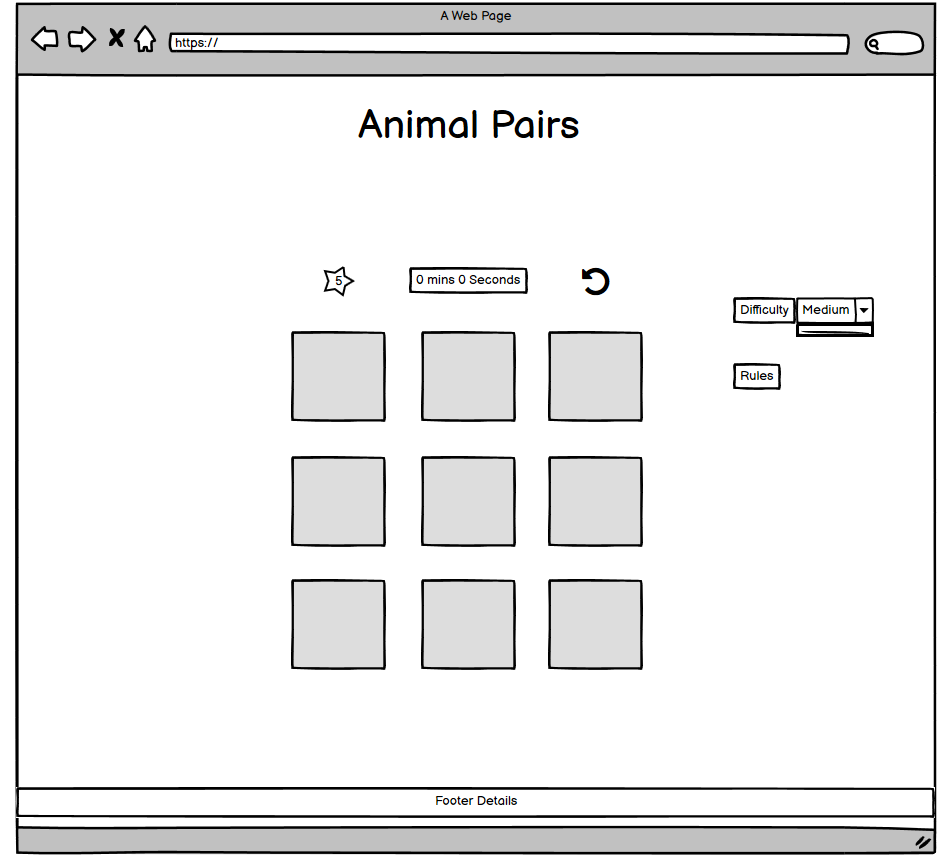
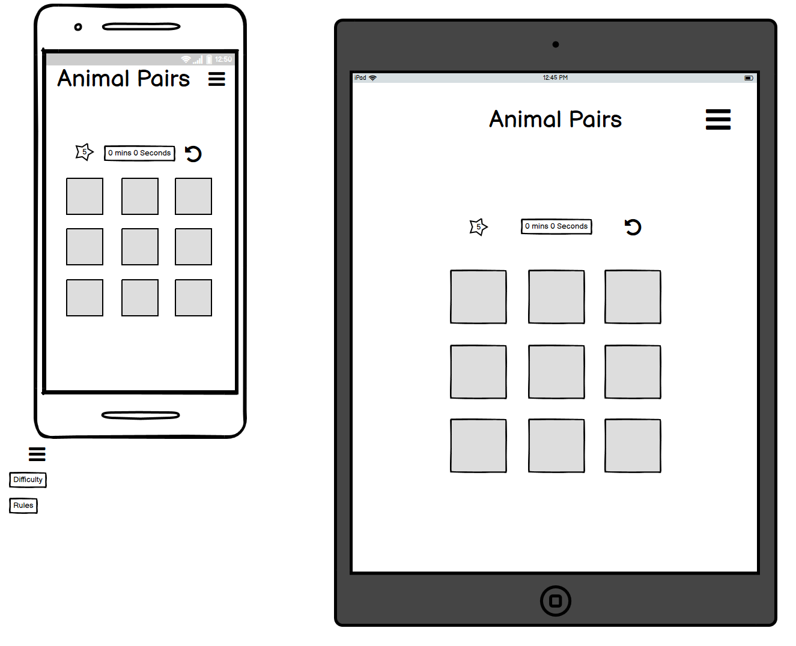

# *Animal Pairs (WORK IN PROGRESS)*
An interactive website to help improve the users memory skills. It has a basic memory game incolving matching up pairs of animal images. 

# Contents
* [**User Experience UX**](<#user-experience-ux>)
    *  [User Stories](<#user-stories>)
    * [Wireframes](<#wireframes>)
    * [Site Structure](<#site-structure>)
    * [Design Choices](<#design-choices>)
    *  [Typography](<#typography>)
    *  [Colour Scheme](<#colour-scheme>)
* [**Features**](<#features>)
    * [**Future Features**](<#future-features>)
* [**Technologies Used**](<#technologies-used>)
* [**Testing**](<#testing>)
* [**Deployment**](<#deployment>)
* [**Credits**](<#credits>)
    * [**Content**](<#content>)
    * [**Media**](<#media>)
*  [**Acknowledgements**](<#acknowledgements>)

# User Experience (UX)
## User Stories
* As a user I want to know the rules.
* As a user I want to know my score.
* As a user I want to know how long it has taken me to complete the game.
* As a user I want to know when I have finished.
* As a user I want to reset the game if I want another attempt.
* As a user I want to make the game easier or harder to suit my skill level.

## Wireframes

## Site Structure

## Design Choices

## Typography

## Colour Scheme

# Features

## Future Features

# Technologies Used

# Testing

# Deployment

# Credits
## Content
## Media

# Acknowledgements
