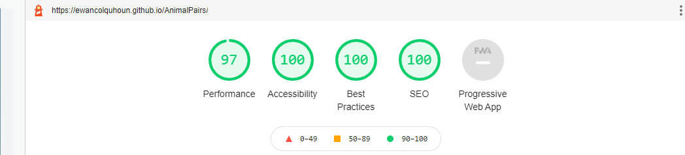

# *Animal Pairs (WORK IN PROGRESS)*
An interactive website to help improve the user's memory skills. It is a basic memory game involving matching up pairs of animal images. It is aimed at an age of 3 upwards. 

# Contents
* [**User Experience UX**](<#user-experience-ux>)
    *  [User Stories](<#user-stories>)
    * [Wireframes](<#wireframes>)
    * [Site Structure](<#site-structure>)
    * [Design Choices](<#design-choices>)
    *  [Typography](<#typography>)
    *  [Colour Scheme](<#colour-scheme>)
* [**Features**](<#features>)
    * [**Existing Features**](<#existing-features>)
    * [**Future Features**](<#future-features>)
* [**Technologies Used**](<#technologies-used>)
* [**Testing**](<#testing>)
* [**Deployment**](<#deployment>)
* [**Credits**](<#credits>)
    * [**Content**](<#content>)
    * [**Media**](<#media>)
*  [**Acknowledgements**](<#acknowledgements>)

# User Experience (UX)
## User Stories
* As a user I want to know the rules.
* As a user I want to know my score.
* As a user I want to know how long it has taken me to complete the game.
* As a user I want to know when I have finished.
* As a user I want to reset the game if I want another attempt.
* As a user I want to make the game easier or harder to suit my skill level.

[Back to top](<#contents>)
## Wireframes

[Back to top](<#contents>)
## Site Structure
Animal Pairs is designed to be simple to use. It has one main page and within that page it has 3 pop-up windows (modals).  
On opening the site you are greeted with the Welcome pop-up that describes the rules of the game as well as offering the user a choice of game difficulty in the form of three buttons. Additionally, there is a button to link to the sound menu popup. The Welcome pop-up can be accessed at any time via the 'Rules' button. 

The sound menu pop-up can be accessed at any time via the volume icon, it has a volume slider and a mute toggle switch. 

The congratulations pop-up is displayed when the user has completed the game. It shows the score, time taken and gives the user the option to start again at a difficulty of their choosing. 

There is a reset button at the bottom of the deck of cards.

[Back to top](<#contents>)
## Design Choices
* ### Typography
    * The main heading is 'Fredericka the Great' in the cursive style. This helps the user get an idea as to what the game is about. It is relaxed yet descriptive.
    * The font for the rest of the site is 'Exo' in the san-serif style. It appears informal yet easy to read at all sizes and weights.

[Back to top](<#contents>)
* ### Colour Scheme
    * The colour schemes chosen for Animal Pairs were primarily chosen to capture the user's eye and imagination. They are bright and vibrant colours to enhance the experience without detracting from the game itself.

Here are some examples of the colours:
* Main background

* Welcome pop-up

* Congratulations pop-up

[Back to top](<#contents>)
# Features
## Existing Features
* ### Welcome pop-up
    * Designed to give the user an introduction to the site and to explain the rules of the game.
    * It has 3 difficulty selector buttons and one sound control button to open the sound controls pop-up.
    * To close the Welcome pop-up the user needs to click anywhere on the screen.

[Back to top](<#contents>)
* ### Rules and Difficulty selector buttons
    * The Rules and Difficulty buttons are located above the game on the main page.
    * The Rules button allows access to the Welcome pop-up and thus the rules of the game at any stage. 
    * The Difficulty drop down buttons allow the user the vary the level of difficulty. When the desired difficulty is selected the game resets.

[Back to top](<#contents>)
* ### Score and timer
    * The score panel is located below the rules button and above the game on the main page. It displays to the user the amount of pairs they have matched against the maximum possible.
    * The timer is located to the right of the score panel. It shows the time elapsed since the first card in that game was clicked. After set periods of time it changes its display to reflect the length of time taken, i.e after 2 minutes it turns red!

[Back to top](<#contents>)
* ### Sound Controls
    * The game has a variety of sounds to enhance the UX. There are card shuffling sounds, card clicking sounds, card not matching sounds, and when a card is matched the sound that is played matches the animal on the matched cards. 
    * The sound menu controls the volume of the site and gives the user the option to mute the sounds all together. 
    * The user can access the sound menu from the sounds button on either the Welcome pop-up (In the top right corner) or the main game page (next to the timer).

[Back to top](<#contents>)
* ### The Sound controls pop-up
    * Accessed by the sound controls buttons it allows the user to change the game sound effects volume at any stage. 
    * It also has a mute function.
    * To exit the sound controls the user needs to click off the sound controls panel.

[Back to top](<#contents>)
* ### The Game
    * The game itself is made up of cards that the user has to turn over. The aim is to match two cards together until the whole 'deck' is matched.
    * The amount of cards on the deck depends on the level of difficulty selected. 
    * There are some basic animations and sounds that interact with the user to enhance the in-game user experience and to encourage further use. 
    * The below picture depicts the game board with two cards turned over. They are unmatched so will turn back over with a slight delay. 

    * The below picture depicts the game with most of the cards matched.

[Back to top](<#contents>)
* ### Congratulations pop-up
    * The Congratulations pop-up is shown when the game is complete. 
    * It displays the time-taken to complete the game. It also shows the score and an interpretation of the score vs moves result.
    * It gives the user the option to recommence the game at a difficulty of their choosing.
    * To exit the Congratulations pop-up the user needs to click anywhere on the screen.

[Back to top](<#contents>)
## Future Features
* An item for further development would be a score board for the various users once a player name has been inputted.

# Technologies Used
* [HTML5](https://html.spec.whatwg.org/) - provides the content and structure for the website.
* [CSS](https://www.w3.org/Style/CSS/Overview.en.html) - provides the styling.
* [JavaScript](https://developer.mozilla.org/en-US/docs/Web/JavaScript) - provides the interactivity.
* [Balsamiq](https://balsamiq.com/wireframes/) - used to create the wireframes.
* [Gitpod](https://www.gitpod.io/#get-started) - used to deploy the website.
* [Github](https://github.com/) - used to host and edit the website.
* [AnimateCss](https://animate.style/) - Library used to help with the animations on all devices.

# Testing
## Code Validation
Animal Pairs has be throughly tested. All the code has been run through the [W3C html validator](https://validator.w3.org/), the [W3C CSS validator](https://jigsaw.w3.org/css-validator/) and the [JavaScript JSHint validator](https://jshint.com/). The code passed all of the validators once minor points had been corrected.

The HTML validator results are below:

The CSS validator results are below:

The JSHint validator results showed that there were a number of minor errors such as missing semi-colons. It also flagged up that one of the variables had been defined twice. 

## Responsiveness Test

The responsive design tests were carried out manually with [Google Chrome DevTools](https://developer.chrome.com/docs/devtools/) and [Responsive Design Checker](https://www.responsivedesignchecker.com/).

|        | Moto G4 | Galaxy S5 | iPhone 5 | iPad | iPad Pro | Display <1200px | Display >1200px |
|--------|---------|-----------|----------|------|----------|-----------------|-----------------|
| Render | pass    | pass      | pass     | pass | pass     | pass            | pass            |
| Images | pass    | pass      | pass     | pass | pass     | pass            | pass            |
| Links  | pass    | pass      | pass     | pass | pass     | pass            | pass            |

## Browser Compatibility

Animal Pairs was tested on the following browsers with no visible issues for the user. 
Google Chrome, Microsoft Edge, Safari and Mozilla Firefox. Appearance, functionality and responsiveness were consistent throughout for a range of device sizes and browsers.

## Testing User Stories
* As a user I want to know the rules.
    * On the **Welcome** pop-up there is a discription of the game and the rules involved. This can be accessed anytime with the **'Rules'** button.
    
     
* As a user I want to know my score.
    * Once the game is completed the **Congratulations** pop-up displays the result. Either excellent, good or it gives some helpful advice for next time.
    
     
* As a user I want to know how long it has taken me to complete the game.
    * There is a **timer** visible above the 'deck' of cards. Once the game has completed the Congratulations pop-up has the final time displayed.
    
     
* As a user I want to know when I have finished.
    * When all the cards are matched the **Congratulations** pop-up is displayed. Above the 'deck' there is also a tally of the pairs found and the maximum amount of pairs available.
    
     
* As a user I want to reset the game if I want another attempt.
    * There are many ways to reset the game. The **reset button** at the bottom of the 'deck'. The difficulty buttons on the main page or the through the 'Rules' button and the Welcome pop-up.
    
     
* As a user I want to make the game easier or harder to suit my skill level.
    * The level of challenged in this game is determined by the amount of cards in the 'deck'. This can be changed using the **'Difficulty'** dropdown menu. The 'deck' size varies between 12 cards (on easy) to 20 cards (on hard).

## Additional Testing
### Lighthouse
The site was also tested using [Google Lighthouse](https://developers.google.com/web/tools/lighthouse) in Chrome Developer Tools to test each of the pages for:
* Performance - How the page performs whilst loading.
* Accessibility - Is the site acccessible for all users and how can it be improved.
* Best Practices - Site conforms to industry best practices.
* SEO - Search engine optimisation. Is the site optimised for search engine result rankings.

As an example the results for Wawas Woods home page are below:

This part of the testing process showed up that the site was slow to load, mainly due to the image sizes. All the images needed to be compressed before adding to the repository. Once this was done the performance went from ~60% to ~90%. 

### Peer review
In addition to the above testing the beta version of the site was put through its paces by peers, both in the software development field and outside. The results highlighted responsive design weakness for a type of mobile device that was rectified with minor CSS amendments. There were also minor spelling and grammar errors that have since been fixed.

# Deployment
### **To deploy the project**
The site was deployed to GitHub pages. The steps to deploy a site are as follows:
  1. In the GitHub repository, navigate to the **Settings** tab.
  2. Once in Settings, navigate to the **Pages** tab on the left hand side.
  3. Under **Source**, select the branch to **master**, then click **save**.
  4. Once the master branch has been selected, the page will be automatically refreshed with a detailed ribbon display to indicate the successful deployment.

  The live link to the Github repository can be found here - https://github.com/EwanColquhoun/AnimalPairs

### **To fork the repository on GitHub**
A copy of the GitHub Repository can be made by forking the GitHub account. This copy can be viewed and changes can be made to the copy without affecting the original repository. Take the following steps to fork the repository;
1. Log in to **GitHub** and locate the [repository](https://github.com/EwanColquhoun/AnimalPairs).
2. On the right hand side of the page inline with the repository name is a button called **'Fork'**, click on the button to create a copy of the original repository in your GitHub Account.

### **To create a local clone of this project**
The method from cloning a project from GitHub is below:

1. Under the repository’s name, click on the **code** tab.
2. In the **Clone with HTTPS** section, click on the clipboard icon to copy the given URL.

3. In your IDE of choice, open **Git Bash**.
4. Change the current working directory to the location where you want the cloned directory to be made.
5. Type **git clone**, and then paste the URL copied from GitHub.
6. Press **enter** and the local clone will be created.

# Credits
* ## Content
    * The font came from [Google Fonts](https://fonts.google.com/).
    * The colour palate was compiled by [Colormind](http://colormind.io/).
    * The icons came from [Font Awesome](https://fontawesome.com/).
    * [Balsamiq](https://balsamiq.com/wireframes/) was used to create the wireframes.
    * The framework for the timer came from [Daniel Hug](https://jsfiddle.net/Daniel_Hug/pvk6p/).

* ## Media
    * The animal sound effects were from [Free Sound Effects](https://www.freesoundeffects.com).
    * The majority of the card sounds were found here [Mix Kit](https://mixkit.co/free-sound-effects).
    * The animal images were from [Unsplash](https://unsplash.com/).
    * The favicon came from [FreeFavIcon](https://www.freefavicon.com/freefavicons/animal/index.php).

# Acknowledgements
The site was completed as a Portfolio 2 Project piece for the Full Stack Software Developer (e-Commerce) Diploma at the [Code Institute](https://codeinstitute.net/). As such I would like to thank my mentor [Precious Ijege](https://www.linkedin.com/in/precious-ijege-908a00168/), the Slack community, and all at the Code Institute for their help and support.

Ewan Colquhoun 2021.