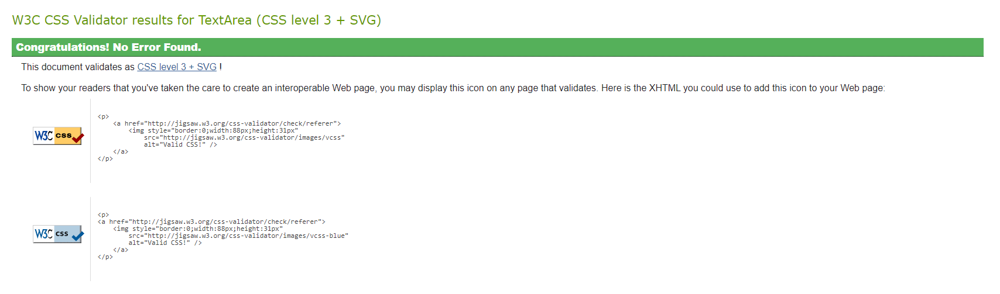

# Testing
## Code Validation
Animal Pairs has be throughly tested. All the code has been run through the [W3C html validator](https://validator.w3.org/), the [W3C CSS validator](https://jigsaw.w3.org/css-validator/) and the [JavaScript JSHint validator](https://jshint.com/). The code passed all of the validators once minor points had been corrected.

The HTML validator results are below:

The CSS validator results are below:

The JSHint validator results showed that there were a number of minor errors such as missing semi-colons. It also flagged up that one of the variables had been defined twice. These were easily corrected and subsequent passes through JSHint revealed no major flaws.

## Responsiveness Test

The responsive design tests were carried out manually with [Google Chrome DevTools](https://developer.chrome.com/docs/devtools/) and [Responsive Design Checker](https://www.responsivedesignchecker.com/).

|        | Moto G4 | Galaxy S5 | iPhone 5 | iPad | iPad Pro | Display <1200px | Display >1200px |
|--------|---------|-----------|----------|------|----------|-----------------|-----------------|
| Render | pass    | pass      | pass     | pass | pass     | pass            | pass            |
| Images | pass    | pass      | pass     | pass | pass     | pass            | pass            |
| Links  | pass    | pass      | pass     | pass | pass     | pass            | pass            |

## Browser Compatibility

Animal Pairs was tested on the following browsers with no visible issues for the user. 
Google Chrome, Microsoft Edge, Safari and Mozilla Firefox. Appearance, functionality and responsiveness were consistent throughout for a range of device sizes and browsers.

## Testing User Stories
* As a user I want to know the rules.
    * On the **Welcome** pop-up there is a discription of the game and the rules involved. This can be accessed anytime with the **'Rules'** button.
    
     
* As a user I want to know my score.
    * Once the game is completed the **Congratulations** pop-up displays the result. Either excellent, good or it gives some helpful advice for next time.
    
     
* As a user I want to know how long it has taken me to complete the game.
    * There is a **timer** visible above the 'deck' of cards. Once the game has completed the Congratulations pop-up has the final time displayed.
    
     
* As a user I want to know when I have finished.
    * When all the cards are matched the **Congratulations** pop-up is displayed. 
    * Above the 'deck' there is also a tally of the pairs found and the maximum amount of pairs available.
    
     
* As a user I want to reset the game if I want another attempt.
    * There are many ways to reset the game. The **reset button** at the bottom of the 'deck'. The **difficulty buttons** on the main page or the through the '**Rules**' button and the Welcome pop-up.
    
     
* As a user I want to make the game easier or harder to suit my skill level.
    * The level of challenged in this game is determined by the amount of cards in the 'deck'. This can be changed using the **'Difficulty'** dropdown menu. The 'deck' size varies between 12 cards (on easy) to 20 cards (on hard).

## Known Bugs
* ### Resolved
    * The audioMute function didn't mute the playAnimalSounds function. This was due to an oversight and was picked up during the testing process. It was easily resolved with more code that read the status of the soundMute variable.

    * When the playAnimalSound function was first called it resulted in the sound effect playing in full. To get around this a timeout was added to pause the sound effect after a set period of time.
   

    * There were some bugs with the modal sizes when viewed on older iPhones. This required an additional media query once the modals were resized. 

* ### Unresolved
    * When the page is loaded in the IDE (GitPod in this case) the asset for the background doesn't load. It loads on every other device/browser. This is a bug that I have not experienced before and at the time of writing I am still looking into it. At first glance it doesn't appear to affect the deployed site.

## Additional Testing
### Lighthouse
The site was also tested using [Google Lighthouse](https://developers.google.com/web/tools/lighthouse) in Chrome Developer Tools to test each of the pages for:
* Performance - How the page performs whilst loading.
* Accessibility - Is the site acccessible for all users and how can it be improved.
* Best Practices - Site conforms to industry best practices.
* SEO - Search engine optimisation. Is the site optimised for search engine result rankings.

Here are the results from the Animal Pairs test. 

This part of the testing process showed up that the site was slow to load. All the images were compressed and the 'prefectch' function was added to the link elements in the head of the INDEX.page. This sped up the loading time and increased the performance rating.

### Peer review
In addition to the above testing the beta version of the site was put through its paces by peers, both in the software development field and outside. Animal Pairs has also been tested by a 3 year old who managed to navigate the cards and grasp the concept of the game without much guidance.

Back to [README.md](./README.md#testing).